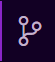
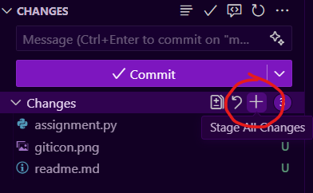

# Flex Day 3/28

Follow the directions for each problem. Write the word pytest in the terminal then press enter to see if your answer is correct.

```
pytest
```
When you are done, click the Git Icon on the left of VS Code\
  


Click the Plus Sign to stage all changes\


Then click the big "Commit" Button. Click it again when it says "Sync" to submit your assignment

**Important** Remember to save before running pyest.